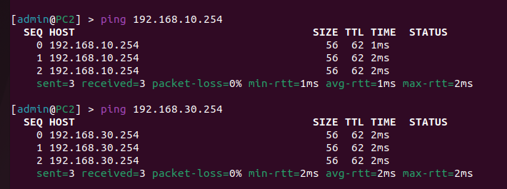

University: <a href="https://itmo.ru/ru/">ITMO University</a>

Faculty: <a href="https://fict.itmo.ru">FICT</a>

Course: <a href="https://github.com/itmo-ict-faculty/introduction-in-routing">Introduction in routing</a>

Year: 2022/2023

Group: K33212

Author: Guseynov Guseyn Muradovich

Lab: Lab2

Date of create: 27.11.2022

Date of finished: 16.12.2022
<h1>Лаборторная работа 2 "Эмуляция распределенной  корпоративной сети связи, настройка статической маршрутизации между филиалами"</h1>

<b>Цель работы:</b>

Ознакомиться с принципами планирования IP адресов, настройке статической маршрутизации и сетевыми функциями устройств.

<b>Ход работы:</b>

Схема связи:

<ins>Текст конфигураций для каждого сетевого устройства</ins>

R01.MSK:

<pre><code>
/ip pool
add name=pool1 ranges=192.168.10.10-192.168.10.254
/ip dhcp-server
add address-pool=pool1 disabled=no interface=ether4 name=dhcp1
/ip address
add address=172.15.255.30/30 interface=ether1 network=172.15.255.28
add address=10.10.1.1/30 interface=ether2 network=10.10.1.0
add address=10.10.2.1/30 interface=ether3 network=10.10.2.0
add address=192.168.10.1/24 interface=ether4 network=192.168.10.0
/ip dhcp-client
add disabled=no interface=ether1
/ip route
add distance=1 dst-address=192.168.20.0/24 gateway=10.10.2.2
add distance=1 dst-address=192.168.30.0/24 gateway=10.10.1.2
/system identity
set name=R01.MSK
</code></pre>

R01.FRT:

<pre><code>
/ip pool
add name=pool2 ranges=192.168.20.10-192.168.20.254
/ip dhcp-server
add address-pool=pool2 disabled=no interface=ether4 name=dhcp2
/ip address
add address=172.15.255.30/30 interface=ether1 network=172.15.255.28
add address=10.10.2.2/30 interface=ether3 network=10.10.2.0
add address=10.10.3.1/30 interface=ether2 network=10.10.3.0
add address=192.168.20.1/24 interface=ether4 network=192.168.20.0
/ip dhcp-client
add disabled=no interface=ether1
/ip route
add distance=1 dst-address=192.168.10.0/24 gateway=10.10.2.1
add distance=1 dst-address=192.168.30.0/24 gateway=10.10.3.2
/system identity
set name=R01.FRT
</pre></code>

R01.BRL:

<pre><code>
/ip pool
add name=pool3 ranges=192.168.30.10-192.168.30.254
/ip dhcp-server
add address-pool=pool3 disabled=no interface=ether4 name=dhcp3
/ip address
add address=172.15.255.30/30 interface=ether1 network=172.15.255.28
add address=10.10.1.2/30 interface=ether2 network=10.10.1.0
add address=10.10.3.2/30 interface=ether3 network=10.10.3.0
add address=192.168.30.1/24 interface=ether4 network=192.168.30.0
/ip dhcp-client
add disabled=no interface=ether1
/ip route
add distance=1 dst-address=192.168.10.0/24 gateway=10.10.1.1
add distance=1 dst-address=192.168.20.0/24 gateway=10.10.3.1
/system identity
set name=R01.BRL
</pre></code>

PC1:

<pre><code>
/ip address
add address=172.15.255.30/30 interface=ether1 network=172.15.255.28
/ip dhcp-client
add disabled=no interface=ether1
add disabled=no interface=ether2
/ip route
add distance=1 dst-address=10.10.1.0/30 gateway=192.168.10.1
add distance=1 dst-address=10.10.2.0/30 gateway=192.168.10.1
add distance=1 dst-address=192.168.20.0/24 gateway=192.168.10.1
add distance=1 dst-address=192.168.30.0/24 gateway=192.168.10.1
/system identity
set name=PC1
</pre></code>

PC2:

<pre><code>
/ip address
add address=172.15.255.30/30 interface=ether1 network=172.15.255.28
/ip dhcp-client
add disabled=no interface=ether1
add disabled=no interface=ether2
/ip route
add distance=1 dst-address=10.10.2.0/30 gateway=192.168.20.1
add distance=1 dst-address=10.10.3.0/30 gateway=192.168.20.1
add distance=1 dst-address=192.168.10.0/24 gateway=192.168.20.1
add distance=1 dst-address=192.168.30.0/24 gateway=192.168.20.1
/system identity
set name=PC2
</pre></code>

PC3:

<pre><code>
/ip address
add address=172.15.255.30/30 interface=ether1 network=172.15.255.28
/ip dhcp-client
add disabled=no interface=ether1
add disabled=no interface=ether2
/ip route
add distance=1 dst-address=10.10.1.0/30 gateway=192.168.30.1
add distance=1 dst-address=10.10.3.0/30 gateway=192.168.30.1
add distance=1 dst-address=192.168.10.0/24 gateway=192.168.30.1
add distance=1 dst-address=192.168.20.0/24 gateway=192.168.30.1
/system identity
set name=PC3
</pre></code>

<ins>Результаты пингов, проверки локальной связности</ins>

<b>Вывод:</b>

В ходе лабораторной работы мы ознакомились с принципами планирования IP адресов, настройкой статической маршрутизации и сетевыми функциями устройств.

