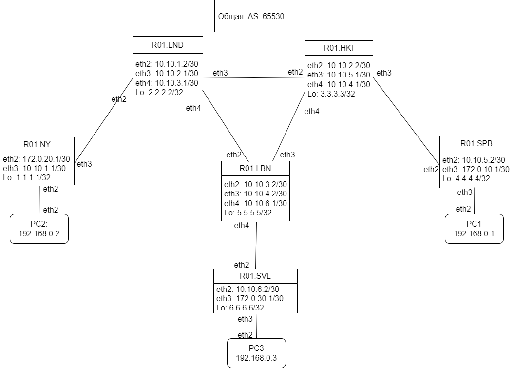
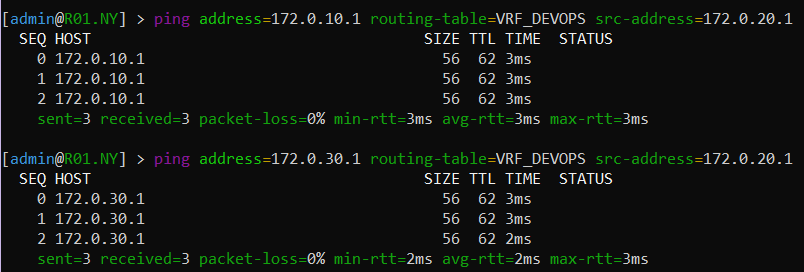
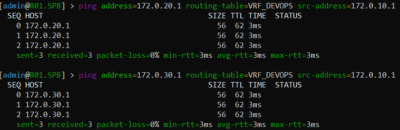
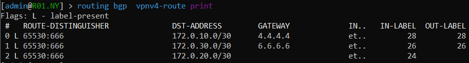
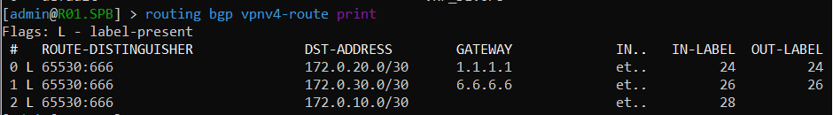
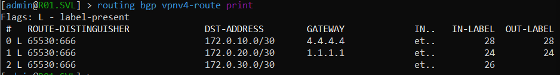
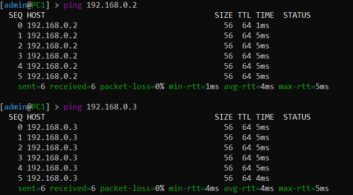
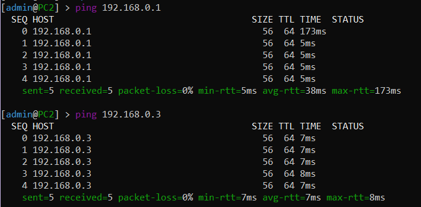
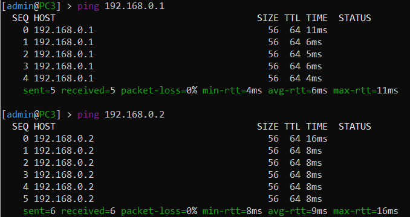

 #### University: [ITMO University](https://##3itmo.ru/ru/)
 #### Faculty: [FICT](https://fict.itmo.ru)
 #### Course: [Introduction in routing](https://github.com/itmo-ict-faculty/introduction-in-routing)
 #### Year: 2022/2023
 #### Group: K33212
 #### Author: Guseynov Guseyn Muradovich
 #### Lab: Lab4
 #### Date of create: 26.12.2022
 #### Date of finished: 09.01.2023

# **Отчёт по лабораторной работе №4**

# Эмуляция распределенной корпоративной сети связи, настройка iBGP, организация L3VPN, VPLS

# Цель работы
Изучить протоколы BGP, MPLS и правила организации L3VPN и VPLS.

# Ход работы
В Containerlab была создана IP/MPLS сеть компании. Её топология описана в yaml файле: 

```
name: lab4
mgmt:
  network: lab4
  ipv4_subnet: 172.20.20.0/24

topology:
  nodes:
    R01.NY:
      kind: vr-ros
      image: vrnetlab/vr-routeros:6.47.9
      mgmt_ipv4: 172.20.20.10

    R01.LND:
      kind: vr-ros
      image: vrnetlab/vr-routeros:6.47.9
      mgmt_ipv4: 172.20.20.11

    R01.HKI:
      kind: vr-ros
      image: vrnetlab/vr-routeros:6.47.9
      mgmt_ipv4: 172.20.20.12

    R01.SPB:
      kind: vr-ros
      image: vrnetlab/vr-routeros:6.47.9
      mgmt_ipv4: 172.20.20.13

    R01.LBN:
      kind: vr-ros
      image: vrnetlab/vr-routeros:6.47.9
      mgmt_ipv4: 172.20.20.14

    R01.SVL:
      kind: vr-ros
      image: vrnetlab/vr-routeros:6.47.9
      mgmt_ipv4: 172.20.20.15

    PC1:
      kind: vr-ros
      image: vrnetlab/vr-routeros:6.47.9
      mgmt_ipv4: 172.20.20.1

    PC2:
      kind: vr-ros
      image: vrnetlab/vr-routeros:6.47.9
      mgmt_ipv4: 172.20.20.2

    PC3:
      kind: vr-ros
      image: vrnetlab/vr-routeros:6.47.9
      mgmt_ipv4: 172.20.20.3

  links:
    - endpoints: ["R01.NY:eth2","R01.LND:eth1"]
    - endpoints: ["R01.LND:eth3","R01.LBN:eth1"]
    - endpoints: ["R01.LND:eth2","R01.HKI:eth1"]
    - endpoints: ["R01.HKI:eth3","R01.LBN:eth2"]
    - endpoints: ["R01.HKI:eth2","R01.SPB:eth1"]
    - endpoints: ["R01.LBN:eth3","R01.SVL:eth1"]
    - endpoints: ["PC1:eth1","R01.SPB:eth2"]
    - endpoints: ["PC2:eth1","R01.NY:eth1"]
    - endpoints: ["PC3:eth1","R01.SVL:eth2"]
 ```

 Схема спроектированной сети:
 

На интерйесах устройств были настроены IP адреса, OSPF и MPLS, iBGP и L3VPN.

Конфигурации сетевых устройств:
- R01.NY:
```/interface bridge
add name=Lo
/interface wireless security-profiles
set [ find default=yes ] supplicant-identity=MikroTik
/routing bgp instance
set default router-id=1.1.1.1
/routing ospf instance
set [ find default=yes ] router-id=1.1.1.1
/ip address
add address=172.31.255.30/30 interface=ether1 network=172.31.255.28
add address=1.1.1.1 interface=Lo network=1.1.1.1
add address=172.0.20.1/30 interface=ether2 network=172.0.20.0
add address=10.10.1.1/30 interface=ether3 network=10.10.1.0
/ip dhcp-client
add disabled=no interface=ether1
/ip route vrf
add export-route-targets=65530:666 import-route-targets=65530:666 interfaces=ether2 \
    route-distinguisher=65530:666 routing-mark=VRF_DEVOPS
/mpls ldp
set enabled=yes
/mpls ldp interface
add interface=ether3
/routing bgp instance vrf
add redistribute-connected=yes routing-mark=VRF_DEVOPS
/routing bgp peer
add address-families=ip,l2vpn,l2vpn-cisco,vpnv4 name=peer1 remote-address=2.2.2.2 remote-as=65530 \
    update-source=Lo
/routing ospf network
add area=backbone
/system identity
set name=R01.NY
```
- Роутер R01.LND:
```/interface bridge
add name=Lo
/interface wireless security-profiles
set [ find default=yes ] supplicant-identity=MikroTik
/routing bgp instance
set default router-id=2.2.2.2
/routing ospf instance
set [ find default=yes ] router-id=2.2.2.2
/ip address
add address=172.31.255.30/30 interface=ether1 network=172.31.255.28
add address=2.2.2.2 interface=Lo network=2.2.2.2
add address=10.10.1.2/30 interface=ether2 network=10.10.1.0
add address=10.10.2.1/30 interface=ether3 network=10.10.2.0
add address=10.10.3.1/30 interface=ether4 network=10.10.3.0
/ip dhcp-client
add disabled=no interface=ether1
/mpls ldp
set enabled=yes
/mpls ldp interface
add interface=ether2
add interface=ether3
add interface=ether4
/routing bgp peer
add address-families=ip,l2vpn,l2vpn-cisco,vpnv4 name=peer1 remote-address=1.1.1.1 remote-as=65530 \
    update-source=Lo
add address-families=ip,l2vpn,l2vpn-cisco,vpnv4 name=peer2 remote-address=3.3.3.3 remote-as=65530 \
    route-reflect=yes update-source=Lo
add address-families=ip,l2vpn,l2vpn-cisco,vpnv4 name=peer3 remote-address=5.5.5.5 remote-as=65530 \
    route-reflect=yes update-source=Lo
/routing ospf network
add area=backbone
/system identity
set name=R01.LND
```
- Роутер R01.HKI:
```/interface bridge
add name=Lo
/interface wireless security-profiles
set [ find default=yes ] supplicant-identity=MikroTik
/routing bgp instance
set default router-id=3.3.3.3
/routing ospf instance
set [ find default=yes ] router-id=3.3.3.3
/ip address
add address=172.31.255.30/30 interface=ether1 network=172.31.255.28
add address=3.3.3.3 interface=Lo network=3.3.3.3
add address=10.10.2.2/30 interface=ether2 network=10.10.2.0
add address=10.10.5.1/30 interface=ether3 network=10.10.5.0
add address=10.10.4.1/30 interface=ether4 network=10.10.4.0
/ip dhcp-client
add disabled=no interface=ether1
/mpls ldp
set enabled=yes
/mpls ldp interface
add interface=ether2
add interface=ether3
add interface=ether4
/routing bgp peer
add address-families=ip,l2vpn,l2vpn-cisco,vpnv4 name=peer1 remote-address=2.2.2.2 remote-as=65530 \
    route-reflect=yes update-source=Lo
add address-families=ip,l2vpn,l2vpn-cisco,vpnv4 name=peer2 remote-address=4.4.4.4 remote-as=65530 \
    update-source=Lo
add address-families=ip,l2vpn,l2vpn-cisco,vpnv4 name=peer3 remote-address=5.5.5.5 remote-as=65530 \
    route-reflect=yes update-source=Lo
/routing ospf network
add area=backbone
/system identity
set name=R01.HKI
```
- Роутер R01.SPB:
```/interface bridge
add name=Lo
/interface wireless security-profiles
set [ find default=yes ] supplicant-identity=MikroTik
/routing bgp instance
set default router-id=4.4.4.4
/routing ospf instance
set [ find default=yes ] router-id=4.4.4.4
/ip address
add address=172.31.255.30/30 interface=ether1 network=172.31.255.28
add address=4.4.4.4 interface=Lo network=4.4.4.4
add address=10.10.5.2/30 interface=ether2 network=10.10.5.0
add address=172.0.10.1/30 interface=ether3 network=172.0.10.0
/ip dhcp-client
add disabled=no interface=ether1
/ip route vrf
add export-route-targets=65530:666 import-route-targets=65530:666 interfaces=ether3 \
    route-distinguisher=65530:666 routing-mark=VRF_DEVOPS
/mpls ldp
set enabled=yes
/mpls ldp interface
add interface=ether2
/routing bgp instance vrf
add redistribute-connected=yes routing-mark=VRF_DEVOPS
/routing bgp peer
add address-families=ip,l2vpn,l2vpn-cisco,vpnv4 name=peer1 remote-address=3.3.3.3 remote-as=65530 \
    update-source=Lo
/routing ospf network
add area=backbone
/system identity
set name=R01.SPB
```
- Роутер R01.LBN:
```/interface bridge
add name=Lo
/interface wireless security-profiles
set [ find default=yes ] supplicant-identity=MikroTik
/routing ospf instance
set [ find default=yes ] router-id=5.5.5.5
/ip address
add address=172.31.255.30/30 interface=ether1 network=172.31.255.28
add address=5.5.5.5 interface=Lo network=5.5.5.5
add address=10.10.3.2/30 interface=ether2 network=10.10.3.0
add address=10.10.4.2/30 interface=ether3 network=10.10.4.0
add address=10.10.6.1/30 interface=ether4 network=10.10.6.0
/ip dhcp-client
add disabled=no interface=ether1
/mpls ldp
set enabled=yes
/mpls ldp interface
add interface=ether2
add interface=ether3
add interface=ether4
/routing bgp peer
add address-families=ip,l2vpn,l2vpn-cisco,vpnv4 name=peer1 remote-address=2.2.2.2 remote-as=65530 \
    route-reflect=yes update-source=Lo
add address-families=ip,l2vpn,l2vpn-cisco,vpnv4 name=peer2 remote-address=3.3.3.3 remote-as=65530 \
    route-reflect=yes update-source=Lo
add address-families=ip,l2vpn,l2vpn-cisco,vpnv4 name=peer3 remote-address=6.6.6.6 remote-as=65530 \
    update-source=Lo
/routing ospf network
add area=backbone
/system identity
set name=R01.LBN
```
- Роутер R01.SVL:
```/interface bridge
add name=Lo
/interface wireless security-profiles
set [ find default=yes ] supplicant-identity=MikroTik
/routing bgp instance
set default router-id=6.6.6.6
/routing ospf instance
set [ find default=yes ] router-id=6.6.6.6
/ip address
add address=172.31.255.30/30 interface=ether1 network=172.31.255.28
add address=6.6.6.6 interface=Lo network=6.6.6.6
add address=10.10.6.2/30 interface=ether2 network=10.10.6.0
add address=172.0.30.1/30 interface=ether3 network=172.0.30.0
/ip dhcp-client
add disabled=no interface=ether1
/ip route vrf
add export-route-targets=65530:666 import-route-targets=65530:666 interfaces=ether3 \
    route-distinguisher=65530:666 routing-mark=VRF_DEVOPS
/mpls ldp
set enabled=yes
/mpls ldp interface
add interface=ether2
/routing bgp instance vrf
add redistribute-connected=yes routing-mark=VRF_DEVOPS
/routing bgp peer
add address-families=ip,l2vpn,l2vpn-cisco,vpnv4 name=peer1 remote-address=5.5.5.5 remote-as=65530 \
    update-source=Lo
/routing ospf network
add area=backbone
/system identity
set name=R01.SVL
```
Проверка связанности между VRF:

 
 
 
 
 
 

Настройка VPLS

Перед настройкой VPLS на роутерах были разобраны VRF. На компьютерах была настроена IP адресация в одной сети 192.168.0.0/24.

Конфигураций трёх роутеров:

- R01.NY:
```/interface bridge
add name=Lo
add name=VPLS
/interface vpls
add disabled=no l2mtu=1500 mac-address=02:3F:7D:D0:E8:46 name=vpls1 remote-peer=4.4.4.4 vpls-id=10:0
add disabled=no l2mtu=1500 mac-address=02:FD:62:EA:D0:A9 name=vpls2 remote-peer=6.6.6.6 vpls-id=10:0
/interface wireless security-profiles
set [ find default=yes ] supplicant-identity=MikroTik
/routing bgp instance
set default router-id=1.1.1.1
/routing ospf instance
set [ find default=yes ] router-id=1.1.1.1
/interface bridge port
add bridge=VPLS interface=ether2
add bridge=VPLS interface=vpls1
add bridge=VPLS interface=vpls2
/ip address
add address=172.31.255.30/30 interface=ether1 network=172.31.255.28
add address=1.1.1.1 interface=Lo network=1.1.1.1
add address=10.10.1.1/30 interface=ether3 network=10.10.1.0
add address=172.0.20.1/30 interface=ether2 network=172.0.20.0
/ip dhcp-client
add disabled=no interface=ether1
/mpls ldp
set enabled=yes
/mpls ldp interface
add interface=ether3
/routing bgp peer
add address-families=ip,l2vpn,l2vpn-cisco,vpnv4 name=peer1 remote-address=2.2.2.2 remote-as=65530 update-source=Lo
/routing ospf network
add area=backbone
/system identity
set name=R01.NY
```

- R01.SPB:
```/interface bridge
add name=Lo
add name=VPLS
/interface vpls
add disabled=no l2mtu=1500 mac-address=02:2D:B2:04:58:B5 name=vpls1 remote-peer=1.1.1.1 vpls-id=10:0
add disabled=no l2mtu=1500 mac-address=02:07:F9:C5:13:11 name=vpls2 remote-peer=6.6.6.6 vpls-id=10:0
/interface wireless security-profiles
set [ find default=yes ] supplicant-identity=MikroTik
/routing bgp instance
set default router-id=4.4.4.4
/routing ospf instance
set [ find default=yes ] router-id=4.4.4.4
/interface bridge port
add bridge=VPLS interface=ether3
add bridge=VPLS interface=vpls1
add bridge=VPLS interface=vpls2
/ip address
add address=172.31.255.30/30 interface=ether1 network=172.31.255.28
add address=4.4.4.4 interface=Lo network=4.4.4.4
add address=10.10.5.2/30 interface=ether2 network=10.10.5.0
add address=172.0.10.1/30 interface=ether3 network=172.0.10.0
/ip dhcp-client
add disabled=no interface=ether1
/mpls ldp
set enabled=yes
/mpls ldp interface
add interface=ether2
/routing bgp peer
add address-families=ip,l2vpn,l2vpn-cisco,vpnv4 name=peer1 remote-address=3.3.3.3 remote-as=65530 update-source=Lo
/routing ospf network
add area=backbone
/system identity
set name=R01.SPB
```

- Роутер R01.SVL:
```/interface bridge
add name=Lo
add name=VPLS
/interface vpls
add disabled=no l2mtu=1500 mac-address=02:A3:F4:DF:B8:5F name=vpls1 remote-peer=1.1.1.1 vpls-id=10:0
add disabled=no l2mtu=1500 mac-address=02:44:7B:1A:38:5A name=vpls2 remote-peer=4.4.4.4 vpls-id=10:0
/interface wireless security-profiles
set [ find default=yes ] supplicant-identity=MikroTik
/routing bgp instance
set default router-id=6.6.6.6
/routing ospf instance
set [ find default=yes ] router-id=6.6.6.6
/interface bridge port
add bridge=VPLS interface=ether3
add bridge=VPLS interface=vpls1
add bridge=VPLS interface=vpls2
/ip address
add address=172.31.255.30/30 interface=ether1 network=172.31.255.28
add address=6.6.6.6 interface=Lo network=6.6.6.6
add address=10.10.6.2/30 interface=ether2 network=10.10.6.0
add address=172.0.30.1/30 interface=ether3 network=172.0.30.0
/ip dhcp-client
add disabled=no interface=ether1
/mpls ldp
set enabled=yes
/mpls ldp interface
add interface=ether2
/routing bgp peer
add address-families=ip,l2vpn,l2vpn-cisco,vpnv4 name=peer1 remote-address=5.5.5.5 remote-as=65530 update-source=Lo
/routing ospf network
add area=backbone
/system identity
set name=R01.SVL
```

Проверка связанности комьютеров:

 

 

 

# Вывод
Были изучены протоколы BGP, MPLS и правила организации L3VPN и VPLS. 